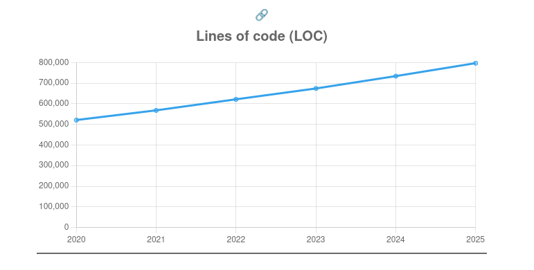
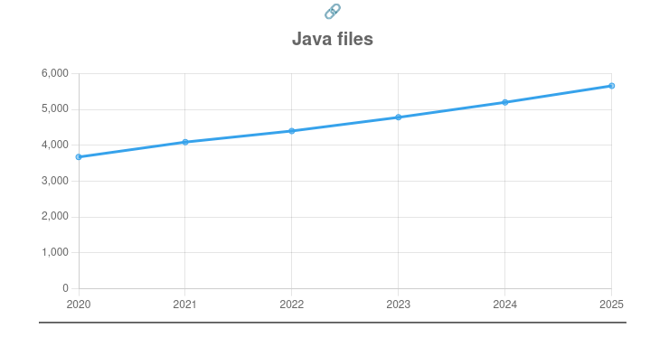
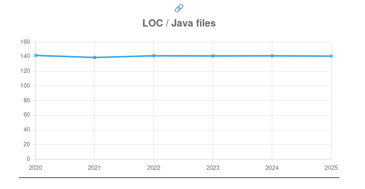

### TL;DR
Repositório selecionado: https://github.com/dbeaver/dbeaver

Gráfico selecionado: LOC, Java Files e LOC/Java Files

Explicação: Abaixo...

### Projeto
Para esta análise, escolhi o projeto [DBeaver](https://github.com/dbeaver/dbeaver), uma plataforma de código aberto voltada para administração de bancos de dados. O DBeaver é amplamente utilizado por desenvolvedores e administradores de dados por oferecer suporte a uma variedade de bancos de dados relacionais e não relacionais, além de contar com uma interface gráfica robusta e recursos avançados de visualização e manipulação de dados. 

Dos gráficos gerados pelo GitEvo, escolhi os gráficos "LOC", "Java files" e "LOC/Java files", que mostram respectivamente a quantidade de linhas de código, a quantidade de arquivos Java e a média de linhas por arquivo, todos com dados de 2020 a 2025.

### Interpretação:
Estes gráficos são úteis para avaliar se o crescimento do sistema está sendo acompanhado por uma boa modularização do código.

Ao observar os gráficos de LOC e Java Files, percebemos que ambas as curvas seguem praticamente a mesma tendência de crescimento. Isso indica que o aumento nas linhas de código foi distribuído em novos arquivos, e não concentrado em arquivos já existentes. Sendo assim, podemos concluir que o projeto tem crescido de maneira estruturada, com uma preocupação em manter os arquivos coesos e com tamanho controlado.

Além disso, o gráfico LOC/Java Files mostra que a média de linhas por arquivo Java se manteve praticamente constante ao longo dos anos, oscilando levemente em torno de 141 linhas por arquivo. Essa estabilidade reforça a ideia de que o crescimento do sistema não comprometeu a modularidade.

### Conclusão:
Assim, podemos inferir que o projeto do dbeaver segue políticas de:
- Modularização consistente: Mesmo com o crescimento do projeto, os desenvolvedores mantiveram um padrão de tamanho médio por arquivo, o que indica boas práticas de engenharia de software.
- Escalabilidade saudável: O projeto parece estar escalando horizontalmente (mais arquivos) em vez de crescer verticalmente (arquivos excessivamente grandes), o que favorece legibilidade, manutenção e testes.